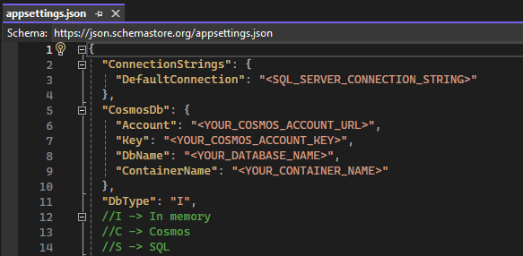

<br/>
<p align="center">
  <a href="https://github.com/fpasqu/modular-api">
    
  </a>

  <h3 align="center">Modular API (.NET 8.0)</h3>

  <p align="center">
     Modular .NET API for training and testing.
    <br/>
    <br/>
    <a href="https://github.com/fpasqu/modular-api/issues">Report Bug</a>
    .
    <a href="https://github.com/fpasqu/modular-api/issues">Request Feature</a>
  </p>
</p>

   

## Table Of Contents

- [Table Of Contents](#table-of-contents)
- [About The Project](#about-the-project)
- [Built With](#built-with)
- [Prerequisites](#prerequisites)
- [Usage](#usage)
- [License](#license)
- [Authors](#authors)

## About The Project

This project allows you to have a good template for testing and experimenting new features for the .NET framework.

## Built With

The API is built with .NET 8.0. It also comes with Swagger, a webpage that allows you to test endpoints.

## Prerequisites

Before running the application, you will need to navigate to the `appsettings.json` file and fill in the necessary info:



To run the application, download the [.NET SDK](https://dotnet.microsoft.com/en-us/download) and run the following command in the project directory:

```sh
dotnet run
```

If you want to run the code in a development environment, download any of the [Visual Studio](https://dotnet.microsoft.com/en-us/download) editions and open the solution file.

## Usage

This project makes use dipendency injection to switch between the three main repositories types:

1. **In memory**: uses a list of predefined Todos where you can simulate actions and responses;
2. **SQL**: uses a SQL Server repository making use of the DbContext, depending on the connection string it can be used to connect to the local Visual Studio istance or a remote db;
3. **Cosmos**: uses a Cosmos db resource from the Azure cloud. 

## License

Distributed under the MIT License. See [LICENSE](https://github.com/fpasqu/modular-api/blob/main/LICENSE) for more information.

## Authors

* **Federico Pasquali** - *IT Consultant* - [fpasqu](https://github.com/fpasqu/)